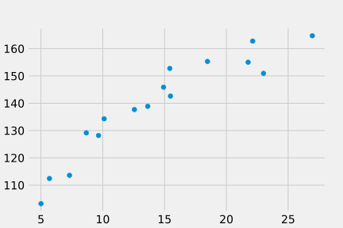
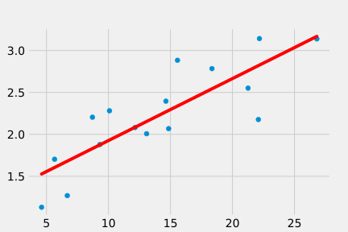
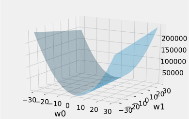
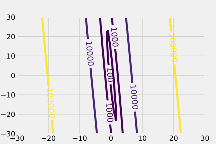

# 線形回帰
## 線形回帰モデル
### 線形規程関数モデル(線形回帰)
回帰問題の目標はN個の観測値\{x_n\}(n=1,...,N)と， それに対応する目標値yの集合からなるデータ集合が与えられた時， 目標値が未知であるxが与えられた時の目標値yを予測するモデル


\LARGE y = w_0+w_1x_1+...+w_Dx_D

<div class="align-center">
    <p>式１：線形回帰モデル</p>
    <p>y:xにおける目標値</p>
    <p>D:入力の次元数(変数の数)</p>
    <p>x:入力変数</p>
    <p>w:パラメータ</p>
</div>

### 単回帰
適当なデータを回帰してみましょう。この目では単回帰(変数が１つの問題)を扱います。求めるべき変数が、直線の傾きになりますね。  
変数が１つというのは上の式のDが1ということなので


\LARGE y = w_1x + w_0

<div class="align-center">
    <p>式２：単回帰モデル</p>
    <p>y:xにおける目標値</p>
    <p>x:入力変数</p>
    <p>w_1:直線yの傾き</p>
    <p>w_0:直線yの切片</p>
</div>

ということになります。  

データは以下のようになっています。
図１に散布図を示します。
```python
X = [15.5641825  22.09007012  4.60613421 12.14309801  8.7090281   6.67849749
  9.30477682 13.07566065 14.63185098 18.34526291 14.84967711 22.17390462
 10.08178346 26.80368421  5.65494661 21.2565694 ]
Y = [2.88360466 2.17708598 1.13066378 2.08154464 2.20449103 1.26892566
 1.87879944 2.00739501 2.39586485 2.78421595 2.06779237 3.14233324
 2.28120739 3.13928765 1.70278745 2.55154764]
```

<div class="align-center">
    
    <p class="figure-disc">図１：データ散布図</p>
</div>
見ての通り、データは直線では表しにくいものですので、新しいデータxに対して確実にコレ！というyを求めることは難しいです(ある点にはかなり近いが違う点からは遠い　など)。ですので、ある程度の誤差は仕方ありません。できる限り誤差を減らし、図２のようなそれらしい直線を引くことが単回帰分析となります。
<div class="align-center">
    
    <p class="figure-disc">図２：単回帰分析後のイメージ</p>
</div>

#### 誤差
どのくらいデータに合っているか、誤差が小さい直線かを判断する目安として、  
平均二乗誤差関数(Mean Squared Error)があります。


\LARGE MSE(y,\hat{y}) = \frac{1}{N} \sum_{n=0}^{N-1} (y_n - \hat{y}_n)

<div class="align-center">
    <p>式３：平均二乗誤差関数</p>
    <p>y:目標値</p>
    <p>\hat{y}:予測値</p>
    <p>N:変数の数(サンプル数)</p>
</div>

この平均二乗誤差関数(MSE)は、実際のデータと回帰した結果の関数との差分(図３の赤い矢印)を二乗したものであり、式３で表されます。二乗しているのは、誤差の正負を考慮しないためです。Nで割って平均にするのは、大きく外れた値によって誤差が大きくなるのをある程度防ぐためです。
<div class="align-center">
    
    <p class="figure-disc">図３：平均二乗誤差関数：各点と回帰直線の差分</p>
</div>
イメージとしてはこれらの矢印をバネに見立てるという考え方になります。各点と回帰直線の間に同じ強さのバネをつけて、バネが動かなくなる点が、距離の二乗和の平均が最小になる(バランスが取れる)ところになるというわけです。  
`仮に各点と直線の距離が同じだとしたらバネは全て同じ長さで安定するはず、、、ですよね？`  
各点かかる力が平均的になるイメージ  

ここでw0とw1と、平均二乗誤差関数の関係を見てみましょう。
<div class="align-center">
    
    <p class="figure-disc">図４：平均二乗誤差関数とパラメータwの関係</p>
</div>
w0は式２でいう切片にあたるので、少しずれるだけで各点からその分だけ離れてしまいます。図４でも勾配が激しくなっていることがわかると思います。  
対してw1方向に動いても図４上では勾配がわかりにくいので、別の図５を見てみてください。
<div class="align-center">
    
    <p class="figure-disc">図５：平均二乗誤差関数の等高線</p>
</div>
わざと誤差が低いところにフォーカスするようにしてみました。w0が固定された値でもw1が変われば平均二乗誤差関数は変動があることがわかると思います。  

w1は式２でいう傾きにあたるので、これがずれても、**近づく点もあるし、離れる点もある**からこのように変化が穏やかになっています

#### 勾配法でw0,w1を求める
グラフ化すれば、平均二乗誤差がどのような動きをしていて、どこらへんの点が最小値なのかはわかると思いますが、実際にどのように計算すればいいのか、ここで**勾配法**を使います。

### 編集後記
使用したサンプルデータ的なものは以下のコードで生成しました
```python
np.random.seed(seed=1)
X_n = 16
X = 5 + 25 * np.random.rand(X_n)
Y=[]
noise = np.random.normal(-0.3,0.3,16)
X = X + noise
for i in X:
  Y.append(math.log(i))

Y = Y + noise
```

X : 0~1の乱数に25を掛けて5を足したものを16個  
Y : Xの対数に、-0.3 ~ 0.3 の間で生成したランダムなノイズを足したもの  
### 参考文献
- C.M.ビショップ, パターン認識と機械学習　上, 丸善出版, 2016年
- 久保隆宏，Pythonで学ぶ強化学習(機械学習スタートアップシリーズ)，講談社，2019年
